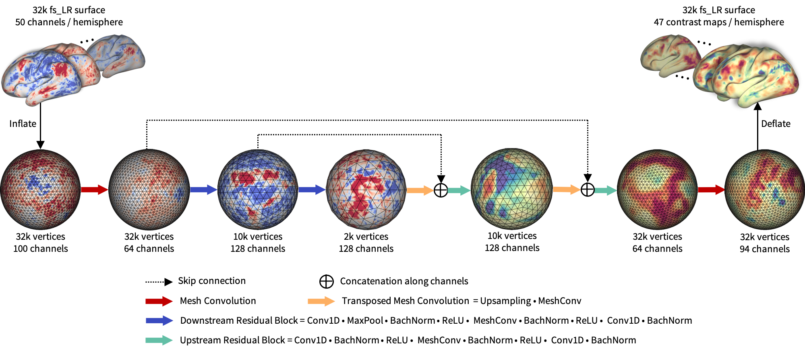

## Reference
Gia H. Ngo, Meenakshi Khosla, Keith Jamison, Amy Kuceyeski, Mert R. Sabuncu. **From Connectomic to Task-evoked Fingerprints: Individualized Prediction of Task Contrasts fromResting-state Functional Connectivity** (Accepted to MICCAI 2020)

[[Project Webpage](https://ngohgia.github.io/brain-surf-cnn)]
[[Paper](https://arxiv.org/pdf/2008.02961.pdf)]

----

## Overview



This project contains the source code for BrainSurfCNN, a surface-based convolutional neural net-work to predict individual task contrasts fromtheir resting-state fingerprints. The model was adapted from the UGSCNN model [github](https://github.com/maxjiang93/ugscnn).

1. [data](./data) folder contains the surface mesh templates, medial-wall mask and subject IDs from the Human Connectome Project (HCP) S1200 used in our experiments for MICCAI2020 paper.
2. [experiments](./experiments) folder contains the scripts to replicate our MICCAI 2020 experiments, and a test example to try out the code on a small sample dataset.
3. [model](./model) folder contains BrainSurfCNN source code.
4. [preprocess](./preprocess) folder contains functions needed for preprocessing the surface data.
5. [utils](./utils) folder contains utility functions to run the experiment and perform post-hoc evaluation.

----

## Getting Started

1. Set up conda environment with the `environment.yml` file provided:
```
conda env create -f environment.yml
source activate brain_surf_cnn
```
Please note that the Pytorch version used in our experiments were installed with CUDA 10.2, but the code is compatible with CUDA 9 as well.

2. Download HCP Workbench [https://www.humanconnectome.org/software/get-connectome-workbench](https://www.humanconnectome.org/software/get-connectome-workbench) for data preprocessing.

3. Download HCP S1200 and HCP Retest dataset [https://db.humanconnectome.org/](https://db.humanconnectome.org), which are used in our MICCAI 2020 experiments. In particular, the preprocessed resting-state timeseries and individual subject's task-based z-stats contrast maps are needed. Such files can be found in the following relative paths on HCP AWS S3 repository:
```
$SUBJ/MNINonLinear/Results/$SESSION/${SESSION}_Atlas_MSMAll_hp2000_clean.dtseries.nii
$SUBJ/MNINonLinear/Results/tfMRI_$TASK/tfMRI_${TASK}_hp200_s2_level2_MSMAll.feat/GrayordinatesStats/cope${COPEID}.feat/zstat1.dtseries.nii
```
where `$SUBJ` is the subject's ID, `$SESSION` is the resting-state sessions (`rfMRI_REST1_LR`, `rfMRI_REST1_RL`, `rfMRI_REST2_LR`, `rfMRI_REST2_RL`), `$TASK` is the 7 fMRI tasks (`LANGUAGE`, `RELATIONAL`, `SOCIAL`, `EMOTION`, `WM`, `MOTOR`, `GAMBLING`), `$COPEID` is the COPE IDs of the specific task contrasts. The exact contrasts (and COPE IDs) used in our experiments can be found in `preprocess/3_separate_task_cifti.sh`.

4. HCP1200 Parcellation+Timeseries+Netmats (PTN) [https://db.humanconnectome.org/data/projects/HCP_1200](https://db.humanconnectome.org/data/projects/HCP_1200) data are also needed for computing the resting-state fingerprints.

5. Run data preprocessing with the scripts under `preprocess` folder.

6. Run training and prediction with the scripts under `experiments` folder.

----

## Bugs and Questions

Please contact Gia at ngohoanggia@gmail.com
